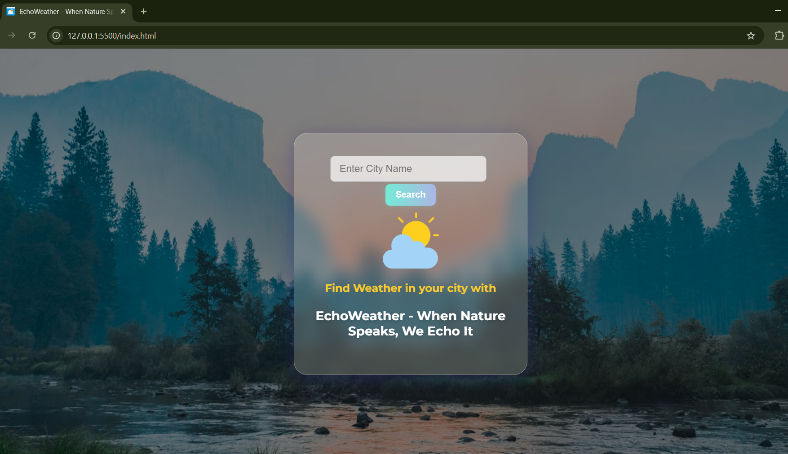
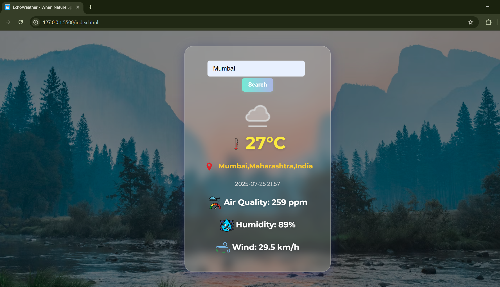
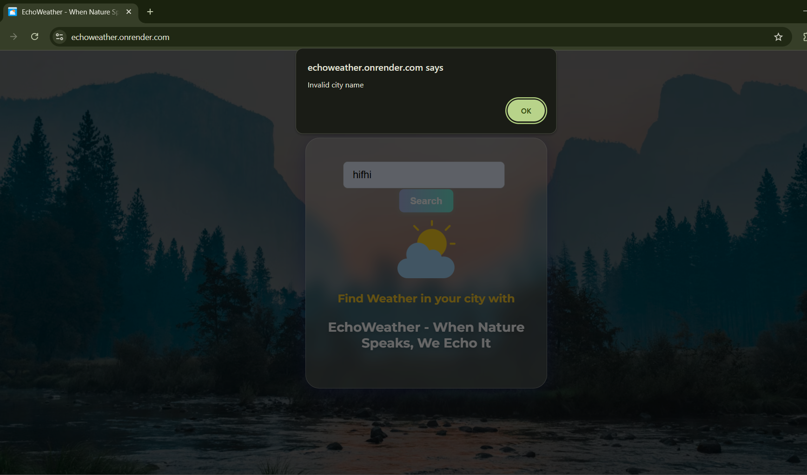

# EchoWeather 🌤️ - When Nature Speaks, We Echo It

EchoWeather is a sleek and responsive weather application built with **HTML**, **CSS**, and **JavaScript**. This app fetches real-time weather data based on the city entered by the user and provides important metrics like **temperature**, **humidity**, **wind speed**, and **air quality**.

---
## ✨ Live Demo
- https://echoweather.onrender.com

## 🔍 Features

- 🌍 Get current weather of any city worldwide
- 🌡️ Shows Temperature, Humidity, Wind Speed
- 🌫️ Air Quality Information
- 🕓 Displays real-time date and time
- 🌄 Beautiful UI with dynamic background and icons

---

## 📸 Screenshots

<p float="left">
  
  
  
</p>


---

## 🛠️ Tech Stack

- **Frontend**: HTML5, CSS3, JavaScript 
- **API Used**: Weather API (like WeatherAPI or OpenWeatherMap)

---

## 🚀 How to Run Locally

1. Clone the repository:
   ```bash
   git clone https://github.com/your-username/echoweather.git

2. Navigate to the project folder:
   ```bash
   cd echoweather
3. Start a live server (VSCode extension or manually open index.html in browser)
4. Enter a city name and hit "Search"
   
## 📁 Project Structure
📦 echoweather<br>
├── index.html<br>
├── style.css<br>
├── script.js<br>
├── images


